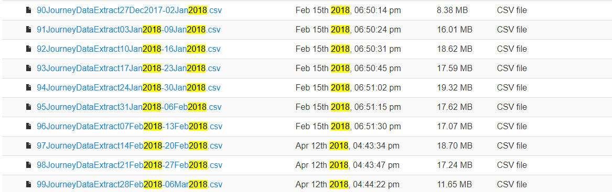
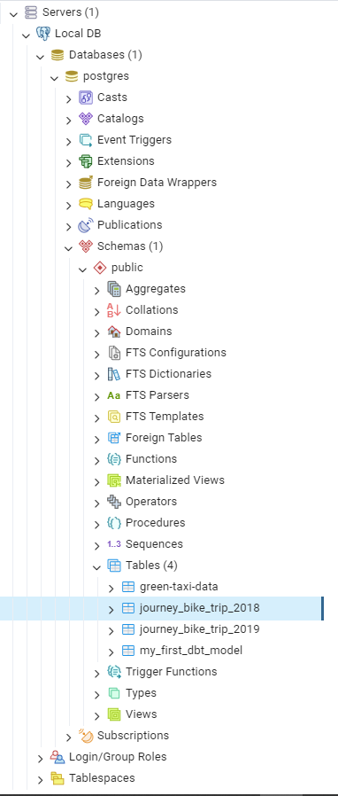

# Introduction


- This is the introduction to the Extract part of this project. 
- We will going through setting up the Docker Container with Postgresql DBMS and PGAdmin for monitoring
- Writing Python script to connect to Postgresql, create table inside it, read csv file and insert it in the database


# Setting up Docker and Postgresql


## Setting .env file: 


- First, you can git clone this repo into your working repository by copy this line to your terminal (or Powershell) :

  ```cmd 
  git clone https://github.com/CyTusSi1ver1197/london_bike_map.git 
  ```

- Then move into the `Extracting_data` directory:

    ```cmd
    cd .\Extracting_data
    ``` 

- In there, create a `.env` file like this:
  
  ```py
    POSTGRES_HOST="localhost"
    POSTGRES_USER="postgres"
    POSTGRES_PASS="12345678"
    POSTGRES_DB="postgres"
    POSTGRES_DB_SCHEMA="public"
    POSTGRES_TABLE="journey_bike_trip"
    POSTGRES_PORT=5433
    DOCKER_POSTGRES_PORT="5433:5432"
    DOCKER_PGADMIN_PORT="8080:80"
  ```
- With:
  
    **POSTGRES_HOST**:

    - This variable specifies the hostname or IP address of the PostgreSQL database server.

    **POSTGRES_USER**:

    - This variable specifies the username used to authenticate with the PostgreSQL database server.

    **POSTGRES_PASS**:

    - This variable specifies the password used to authenticate with the PostgreSQL database server.

    **POSTGRES_DB**:

    - This variable specifies the name of the PostgreSQL database.

    **POSTGRES_DB_SCHEMA**:

    - This variable specifies the schema within the PostgreSQL database where tables and other database objects are located.

    **POSTGRES_TABLE**:

    - This variable specifies the name of the table within the PostgreSQL database.

    **POSTGRES_PORT**:

    - This variable specifies the port number on which the PostgreSQL database server is running.

    **DOCKER_POSTGRES_PORT**:

    - This variable specifies the port number on which the PostgreSQL Docker container is configured to listen.

    **DOCKER_PGADMIN_PORT**:

    - This variable specifies the port number on which the pgAdmin Docker container is configured to listen.

- After configuring the `.env` file has been completed, we can start on creating a Docker container for Postgresql and PGAdmin

    ## Setting Postgresql:

- Opening the `docker-postgres.yml` file to configure more as you like but if you just need a working database, just run:

    ```
    docker compose -f .\Extracting_data\docker-postgres.yml up -d
    ```
- Opening any browser, go to `http://localhost:8080/` to login to the pgAdmin, if succeeded, the browser would look like this:

    

- Inputing `email` and `password` the value of `PGADMIN_DEFAULT_EMAIL` and `PGADMIN_DEFAULT_PASSWORD` in `docker-postgres.yml` respectively to complete the login process, the GUI should look like this:

    

- Choose the `Add New Server` icon, it will show an icon like this:

    

- Choose the `Name` part any name you like then move on to the `Connection` setion:

    

- Then, to completely connect to the database, fill in these sections:
  - `Host name/address`: `POSTGRES_HOST`
  - `Port`: 5432
  - `Username`: `POSTGRES_USER`
  - `Password`: `POSTGRES_PASS`

- The rest could be left as blank, then choose `SAVE` and you have completed connecting to Postgresql on Docker!

    

## Setting up Python script

- Go back to `.env` file and add this line to the end off file:

    ```py
    URL="s3://cycling.data.tfl.gov.uk/usage-stats/"
    ```
- This is where we will retrieve the csv files to put on the database.

- But to show how csv files are stored on the web, we need to go to: `https://cycling.data.tfl.gov.uk/`, scroll down to the end of the page, that's where we get the data:

    

- The data format is consist of "`id` + `JourneyDataExtract` + `start_date` + `end_date` + `.csv`". In the `collect_bike_data.py`, function `generate_csv_name()` is responsible for generating names for the script to get data.

- First, open the terminal inside the working directory and input:

    ```sh
    pip install requirements.txt
    ```
 
- This script's using `psycopg2` to connect and loading csv files to Postgresql database. In order to connect to database, we must first loading our `.env` file by using:

    ```py
    load_dotenv()
    user = os.getenv("POSTGRES_USER")
    password = os.getenv("POSTGRES_PASS")
    host = os.getenv("POSTGRES_HOST") 
    port = os.getenv("POSTGRES_PORT") 
    db = os.getenv("POSTGRES_DB")
    db_schema = os.getenv("POSTGRES_DB_SCHEMA")
    table_name = os.getenv("POSTGRES_TABLE")
    url = os.getenv("URL")
    ```
    or you could copy the value from `.env` to the script itself but this is not a good practice.


- Then, we need to assign these parameters to connect postgres database:
    ```py
    param_dic = {
    "host"      : host,
    "port"      : port,
    "database"  : db,
    "user"      : user,
    "password"  : password,
    "options"   : f"-c search_path=dbo,{db_schema}"
    }
    ```
    `"options"` section is the part you choose your schema in postgresql to connect to, when remove this section, schema is `"public"` by default.

- Next, we need to determine all the attributes of our csv file to create a table for it:

    ```py
    bike_dtypes_postgres = {
        "Rental Id": "BIGINT",
        "Duration": "BIGINT",
        "Bike Id": "BIGINT",
        "End Date": "TIMESTAMP",
        "EndStation Id": "BIGINT",
        "EndStation Name": "TEXT",
        "Start Date": "TIMESTAMP",
        "StartStation Id": "BIGINT",
        "StartStation Name": "TEXT"
    }
    ```

- All of this configuration has been done on the script itself so you could run the script directedly from the terminal:

    ```cmd
    python .\collect_bike_data.py --start 2018 --end 2019
    ```
    where as `--start` is starting year to collecting csv files and `--end` is the ending year to collecting csv files. 

- Your terminal would be like this after running the command:
    ```cmd
    Connection successful
    Start creating table ... 
    Done creating table: journey_bike_trip_2018
    Start creating table ...
    Done creating table: journey_bike_trip_2019
    copy_from_csv() done
    inserted 91JourneyDataExtract03Jan2018-09Jan2018.csv, took 2.075 second
    copy_from_csv() done
    inserted 92JourneyDataExtract10Jan2018-16Jan2018.csv, took 2.812 second
    copy_from_csv() done
    inserted 93JourneyDataExtract17Jan2018-23Jan2018.csv, took 2.835 second
    copy_from_csv() done
    inserted 94JourneyDataExtract24Jan2018-30Jan2018.csv, took 2.895 second
    ...
    ```
- After the script completed loading the csv files, go back to the [pgAdmin pages](localhost:8080):
    

    The `green-taxi-data` and `my_first_dbt_model` are just my testing tables before running the scripts.

- And that's how this script works, feel free to ask any question related to this by adding questions in `Issue` section. 