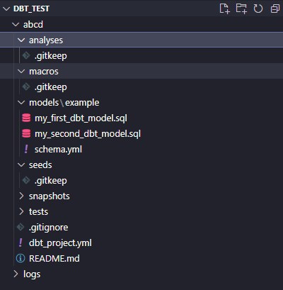
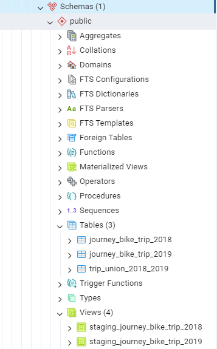

Welcome to your new dbt project!

### Using the starter project

Try running the following commands:
- dbt run
- dbt test


### Resources:
- Learn more about dbt [in the docs](https://docs.getdbt.com/docs/introduction)
- Check out [Discourse](https://discourse.getdbt.com/) for commonly asked questions and answers
- Join the [chat](https://community.getdbt.com/) on Slack for live discussions and support
- Find [dbt events](https://events.getdbt.com) near you
- Check out [the blog](https://blog.getdbt.com/) for the latest news on dbt's development and best practices


## **Introduction to this project**

- Before creating a dbt project, ensures that you have `dbt-core` and `dbt-postgres` install in your python virtual environment 

### **Downloading and install dbt core for python virtual environments:**

- [About dbt Core and installation](https://docs.getdbt.com/docs/core/pip-install)
- [About dbt Core data platform connections](https://docs.getdbt.com/docs/core/connectata-platform/about-core-connections)
- [Postgres setup](https://docs.getdbt.com/docs/core/connect-data-platform/postgres-setup)


### **Creating dbt project**

- After completing installing all dependencies, go to terminal and changing to your virtual environments:

    ```bash
    source dbt-venv/bin/activate         # activate the environment for Mac and Linux OR
    dbt-venv\Scripts\activate            # activate the environment for Windows
    ```
- And then, type `dbt init` inside your terminal: it will show what's the name you want to the project:

    ```bash
    (dbt-venv) PS D:\Project\Zoom_Datatalks_class\01-2024\dbt_test> dbt init
    03:43:07  Running with dbt=1.7.9
    Enter a name for your project (letters, digits, underscore): "name_that you_want"                                                     
    03:43:30
    ```
- Then, it will asked for the connector that's you want to work on, choose `postgres`:
    ```bash
    03:43:30  Setting up your profile.   
    Which database would you like to use?
    [1] postgres

    "Don't see the one you want?: https://docs.getdbt.com/docs/available-adapters"

    Enter a number: 1
    ```
- Inputing postgres parameters from the `Extracting_data\.env`:
    ```bash
      host: [hostname]
      user: [username]
      password: [password]
      port: [port]
      dbname: [database name] # or database instead of dbname
      schema: [dbt schema]
      threads: [optional, 1 or more]
    ```

- After inputing the informations, your file structures should be like this:

    

- `cd` into the dbt folder in the terminal, type `dbt debug` to debug connection to your database, if it show like this at the end of log output, your are good to go.

    ```bash
    04:56:41  All checks passed!
    ```

- After checking connectivity, delete `example` folder in `models` folder, create a folder named `staging` inside `models` and create `schema.yml` file and input:
    ```yml
    version: 2

    sources:
    - name: staging
        database: postgres
        schema: public
        tables:
        - name: journey_bike_trip_2018
        - name: journey_bike_trip_2019
    ```

- Then create to `sql` file inside `models` folder : `staging_journey_bike_trip_2018` and `staging_journey_bike_trip_2019`, input these lines:
    ```sql
    {{
        config(materialized = 'view')
    }}


    with source as (
        select * from {{ source('staging', 'journey_bike_trip_2018') }}
    ),
    renamed as (
        select
            {{ adapter.quote("Rental Id") }},
            {{ adapter.quote("Duration") }},
            {{ adapter.quote("Bike Id") }},
            {{ adapter.quote("End Date") }},
            {{ adapter.quote("EndStation Id") }},
            {{ adapter.quote("EndStation Name") }},
            {{ adapter.quote("Start Date") }},
            {{ adapter.quote("StartStation Id") }},
            {{ adapter.quote("StartStation Name") }}

        from source
    )
    select * from renamed
  
    ```
    for `staging_journey_bike_trip_2019`, change the year in `journey_bike_trip` to `2019`

- And that's how to create a simple staging view inside of a dbt project!

### **Creating a new table for data analysis in database** 

- In this project, the transformation step is merging two tables in the database for analysis in the next phase.

- In the `models` folder, create an `analysis` folder, this will be the folder contains our new table.

- Create a yaml and a sql file to dbt know and run the file like this:
  - yaml:
  
    ```yaml
        version: 2
        models:
            - name: trip_union_2018_2019
    ```  

  - sql:
    ```sql
        {{
            config(
                materialized = 'table'
            )
        }}

        select * from {{ref("staging_journey_bike_trip_2018")}}

        union all

        select * from {{ref("staging_journey_bike_trip_2019")}}
    ```

- The `materialized` parameter is determined by how you want to choose your data presentation.

### **Build a dbt project**

- Use the terminal, go back to the parent folder contains `models` folder, open the `dbt_project.yml` and remove the old `examples` part below models like this:
    
    ```yaml
        models:
        <YOUR_PROJECT_NAME>:
            # Config indicated by + and applies to all files under models/example/
            example: 
    ```

    and add this part in:

    ```yaml
        models:
        <YOUR_PROJECT_NAME>:
            # Config indicated by + and applies to all files under models/example/
            staging:
                materialized: view
            analysis:
                materialized: table
    ```
    this will tell that dbt to start build the sql files in these folder.

- Go back the terminal, type `dbt build` to start the building process, the union table between two files in really big so it will cost some time to build.

- In my project example, I named my table `trip_union_2018_2019.sql`, so after `dbt build` is completed, my database is looked like this:

    

