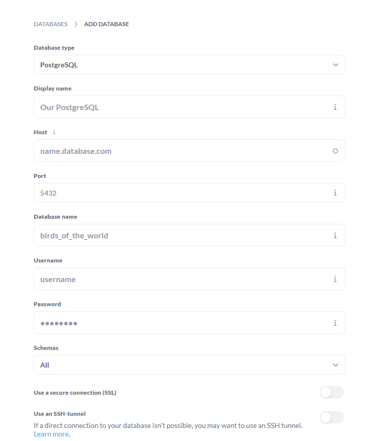
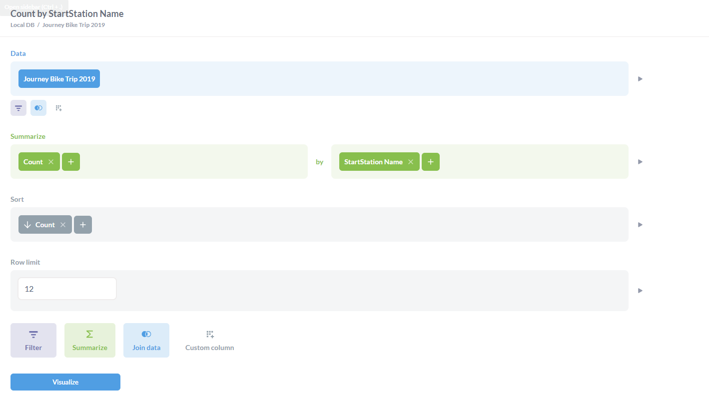
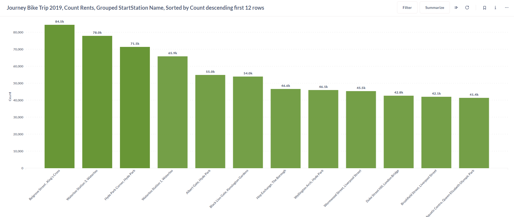
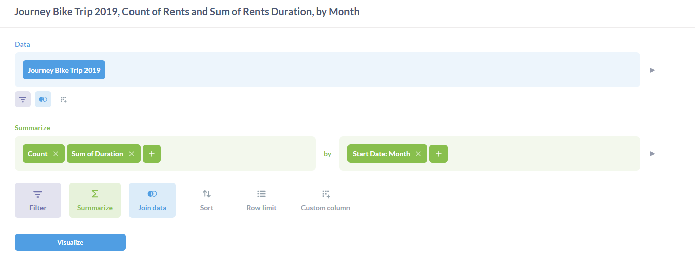
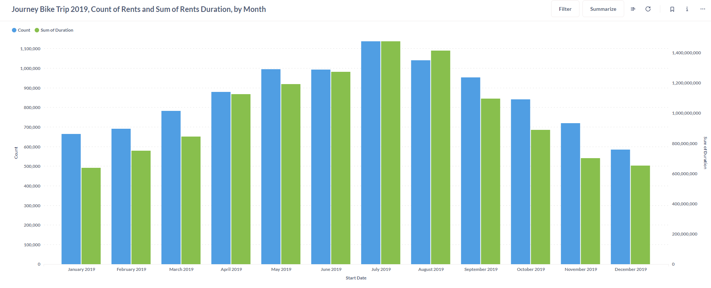
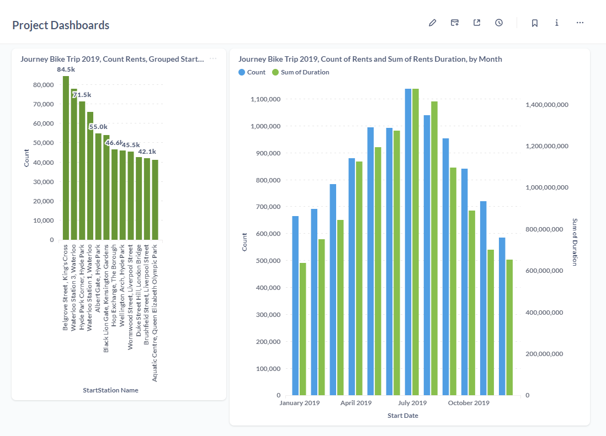

## **Introduction**

- In this project, I will go on and create a dashboard from a local running Metabase in a docker container, connected to the Postgresql database I built from previous parts.

## **Creating docker compose for Metabase**

- Copy the `.env` file from `Extracting_data` to `Visualizing_data` folder

- Create a `.yml` file and add these lines in:

    ```yml
    version: '3.3'

    services:
        db:
        image: postgres:13
        restart: always
        env_file:
            - .env
        environment:
            - POSTGRES_PASSWORD=${POSTGRES_PASS}
            - POSTGRES_USER=${POSTGRES_USER}
            - POSTGRES_DB=${POSTGRES_DB}
        ports:
            - ${DOCKER_POSTGRES_PORT}
        volumes:
            - "../Extracting_data/london_bike_data:/var/lib/postgresql/data"
        networks:
            - postgres-network
        postgres-Admin:
        image: dpage/pgadmin4
        env_file:
            - .env
        environment: 
            - PGADMIN_DEFAULT_EMAIL=admin@admin.com
            - PGADMIN_DEFAULT_PASSWORD=${POSTGRES_PASS}
        ports:
            - ${DOCKER_PGADMIN_PORT}
        networks:
            - postgres-network

        metabase:
        volumes:
            - ./metabase-data:/metabase-data
        env_file:
            - .env
        environment:
            - MB_DB_FILE=/metabase-data/metabase.db
            - MB_DB_TYPE=postgres
            - MB_DB_DBNAME=${POSTGRES_DB}
            - MB_DB_PORT=5432
            - MB_DB_USER=${POSTGRES_USER}
            - MB_DB_PASS=${POSTGRES_PASS}
            - MB_DB_HOST=db
        ports:
            - 3000:3000
        image: metabase/metabase
        restart: always
        depends_on: 
            - db
        networks:
            - postgres-network
    networks:
    postgres-network:
        driver: bridge
    ```

- And then in the terminal, run:
    ```ps
    docker compose -f .\metabase_compose.yml up -d
    ```

## **Login to Metabase and connect to Postgresql**

- After successfully built docker compose, open the browser, type: [http://localhost:3000/](http://localhost:3000/) to access Metabase.

- The first two parts, you can insert whatever values you want, but when come to this part:
    

- You put in these parameters the values of these parameters:

    ```yml
    environment:
    - MB_DB_FILE=/metabase-data/metabase.db
    - MB_DB_TYPE=postgres
    - MB_DB_DBNAME=${POSTGRES_DB}
    - MB_DB_PORT=5432
    - MB_DB_USER=${POSTGRES_USER}
    - MB_DB_PASS=${POSTGRES_PASS}
    - MB_DB_HOST=db
    ```

## **Building dashboards**


### Building Questions in Metabase

- Questions are like the building blocks of dashboards, or you can say, dashboards are built from Questions.

[**Youtube Tutorials for building questions in Metabase.**](https://www.youtube.com/watch?v=VZrNqaHlIBs&list=PL5ZlXxM-0LTF7jb-bn0vLv7IIS3Peg3YK)

- Here's my two Questions with my build selections:

- Selecting the first twelve areas (stations) have the most rent bikes:

    

    - Result:

    

- Selecting the count of rents and the sum of durations by seconds by months:

    

    - Result:
  
       

- Dashboard contains both of Questions:

    